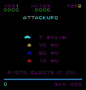

## Attack UFO

inspired by this thread: https://sleepingelephant.com/ipw-web/bulletin/bb/viewtopic.php?t=8775

This is a crude hack to make the japanese arcade game "Attack UFO" work on the
(european) VIC20. it kindof works and can be played, but its nowhere near
perfect, and probably not really playable.

as of now, the game needs RAM in bank0 and uses cartridge ROM in bank 1/2/3/5

you can start it in VICE like this:

 sdl2-xvic -VICflipx -VICflipy -VICrotate -memory all -cart2 ufo2-2000.prg -cart6 ufo2-6000.prg -cartA ufo2-A000.prg

- F7 - insert coins

- F1 - START one player game

- Joystick left/right/fire - guess what :)

gpz 10/12/2017

### Building

use "make" and "make test". requires ACME.

### Status

controls work, it can be played.

the main problem i am facing right now to make this into something others can use is a combination of two things:

- the game uses $0200-$03ff for the screen (video ram)
- the game uses a weird subroutine call mechanism implemented via BRK handlers

so far what i have done is hooking into a routine that gets called once per frame, and then i just copy the screen (and color ram) to some location that is suitable for vic20 :)

### Details

https://github.com/mamedev/mame/blob/master/src/mame/drivers/attckufo.cpp

 VIC at 1000-100f  -> 9000
 PIA at 1400-1403

 RAM  0000-0fff
 RAM  1c00-1fff (dynamic characters)

 VIC videoram: 0000-3fff
    colorram: 0000-03ff

      screen: 0200-03ff (old)
      colors: 0600-07ff (old)

 workcharset: 1c00-1fff (old)
    realchar: 2000-23ff (old) (static characters)

 ->  9400-95FF   location of COLOR RAM with additional RAM at blk 1
 ->  9600-97FF   Normal location of COLOR RAM

 ROM  2000-3fff

 PORT_START("DSW")
 PORT_DIPNAME(0x03, 0x00, DEF_STR( Lives ))
 PORT_DIPSETTING(   0x00, "3")
 PORT_DIPSETTING(   0x01, "4")
 PORT_DIPSETTING(   0x02, "5")
 PORT_DIPSETTING(   0x03, "6")
 PORT_DIPNAME(0x04, 0x04, DEF_STR( Bonus_Life ))
 PORT_DIPSETTING(   0x04, "1000")
 PORT_DIPSETTING(   0x00, "1500")
 PORT_DIPUNUSED(0x08, IP_ACTIVE_LOW)
 PORT_BIT(0x10, IP_ACTIVE_LOW, IPT_UNUSED)
 PORT_BIT(0x20, IP_ACTIVE_LOW, IPT_UNUSED)
 PORT_BIT(0x40, IP_ACTIVE_LOW, IPT_UNUSED)
 PORT_BIT(0x80, IP_ACTIVE_LOW, IPT_COIN1)

 PORT_START("INPUT")
 PORT_BIT(0x01, IP_ACTIVE_LOW, IPT_START1)
 PORT_BIT(0x02, IP_ACTIVE_LOW, IPT_START2)
 PORT_BIT(0x04, IP_ACTIVE_LOW, IPT_JOYSTICK_LEFT)  PORT_PLAYER(1) PORT_2WAY
 PORT_BIT(0x08, IP_ACTIVE_LOW, IPT_JOYSTICK_RIGHT) PORT_PLAYER(1) PORT_2WAY
 PORT_BIT(0x10, IP_ACTIVE_LOW, IPT_BUTTON1)        PORT_PLAYER(1)
 PORT_BIT(0x20, IP_ACTIVE_LOW, IPT_JOYSTICK_LEFT)  PORT_PLAYER(2) PORT_2WAY
 PORT_BIT(0x40, IP_ACTIVE_LOW, IPT_JOYSTICK_RIGHT) PORT_PLAYER(2) PORT_2WAY
 PORT_BIT(0x80, IP_ACTIVE_LOW, IPT_BUTTON1) PORT_PLAYER(2)

